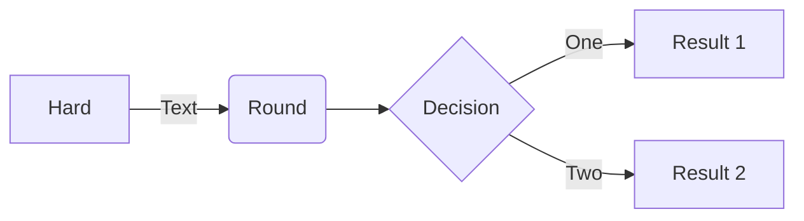

## Integration with GitHub Pages
Jekyll is natively supported by GitHub Pages. This means you can simply push your Jekyll site to a GitHub repository, and GitHub Pages will automatically build and host your site for you. This eliminates the need for manual site generation and deployment.

- Static Site Generation
- Markdown Support
- Customization
- Local Development
- Syntax Highlighting


def print_hi(name)
  puts "Hi, #{name}"
end
print_hi('Tom')
#=> prints 'Hi, Tom' to STDOUT.


## Chirpy
Chirpy is a theme for Jeykll with several key features: [GitHub: cotes2020/jekyll-theme-chirpy](https://github.com/cotes2020/jekyll-theme-chirpy)\
However, some of these features are not supported out of the box in Github Pages.
Because of this, there is an included Github Actions Workflow to build and deploy a Chirpy Jeykll Themed page.\
Follow the Chirpy guide to get started: [Getting Started | Chirpy](https://chirpy.cotes.page/posts/getting-started/)\
Also, checkout my repo for this page for some modifications to Chirpy: [GitHub | brandon-setegn.github.io](https://github.com/brandon-setegn/brandon-setegn.github.io)

## Mermaid Support
One of the nice features of using the Chirpy Jekyll Theme is that you can easily use [Mermaid Charts](https://www.mermaidchart.com/).
These charts can be created in Markdown with text.  They can be built within your Jeyklly-Chirpy project and rendered directly to JavaScript.


flowchart LR

A[Hard] -->|Text| B(Round)
B --> C{Decision}
C -->|One| D[Result 1]
C -->|Two| E[Result 2]


