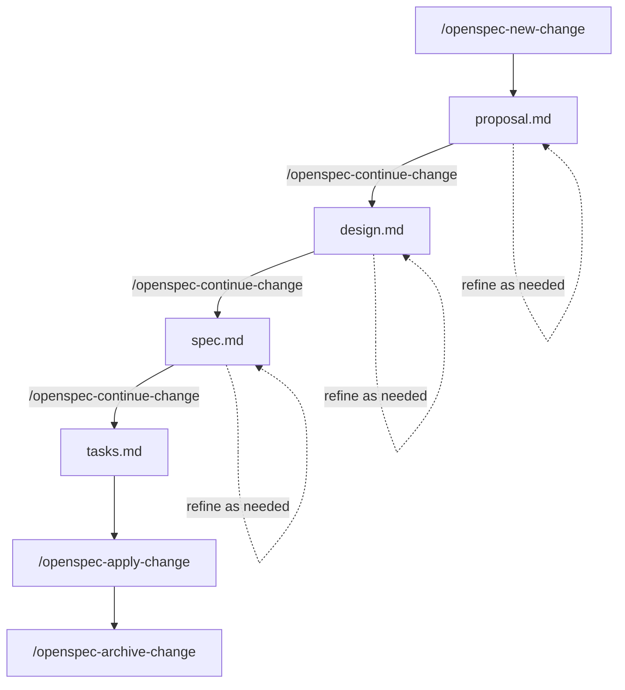

When I originally started working on this post I thought it was going to be about Kafka and how to get started with it. But over the last few weeks I started to do to more _spec-driven development_, mainly with [OpenSpec](https://github.com/Fission-AI/OpenSpec). Having seen how powerful this workflow can be and how it enables you to fully utilize AI coding, I pivoted to this topic.

In this post we use [OpenSpec](https://github.com/Fission-AI/OpenSpec) to drive a small project: a local [Apache Kafka](https://kafka.apache.org/) producer and consumer in Python. The code shows how to stand up a local Kafka server and connect with a [Confluent Python client](https://docs.confluent.io/kafka-clients/python/current/overview.html). The focus here is on how OpenSpec shapes the work and the benefits you get from it.

## Source Code

> The example project is available on GitHub: [kafka-test](https://github.com/brandon-setegn/kafka-test). All code blocks labeled "From the example" below are sourced from that repo.

# Spec-driven Development
**Spec-driven development** is the practice of writing detailed specifications before—and during—implementation, treating those specs as the source of truth for your project's design and architecture. 

> 💡**When working with AI coding assistants, maintaining comprehensive specs in your repository ensures the AI's context window is filled with what matters most: your project's goals, constraints, and design decisions.**

Rather than the AI inferring intent from scattered code comments or incomplete documentation, it can reference your living specifications to understand *why* the system works the way it does and *how* new changes should align with existing architecture. This fundamentally changes how effectively AI assistants can contribute to your codebase—they're no longer just pattern-matching on code, they're reasoning from your documented intent.

# What is OpenSpec?

[OpenSpec](https://github.com/Fission-AI/OpenSpec) is a lightweight framework that gives you **prompts** and **skills** to be used with AI coding assistants. It treats **specifications as the source of truth**: by storing design specs directly in your project's repository, they remain accessible for future modifications. Once the OpenSpec CLI adds these skill files to your project, the tool is no longer required for day-to-day use. You may need it later to update your skills, but there is no long-term tie-in. If you ever move on, you can migrate by taking your spec documents to another format.

## Setup

### Installing OpenSpec

The quickest way to install OpenSpec CLI is via `npm`:
```bash
npm install -g @fission-ai/openspec
```

> There are other installation methods available—check the [OpenSpec documentation](https://github.com/Fission-AI/OpenSpec/blob/main/docs/installation.md) for alternatives.

### Initializing Your Project

Once installed, navigate to your project directory and run the initialization command:
```bash
openspec init
```

This creates the necessary directory structure and starter files for your specs and skills.

{: width="377" height="263" }

{: width="592" height="401" }
_OpenSpec Init Options_

For my selected IDE _Cursor_, the `init` command set up these folders with markdown files. These files add skills, which are just improved prompts, to be used by the AI assistant.

{: width="306" height="475" }
_OpenSpec Skills Mardown Files_

These new skills are available to use in the chat window or command line with your AI assistant. Your tool should add these to autocomplete when using `/` or have a skills menu in the CLI.

{: width="606" height="457" }
_OpenSpec Skills in Chat Window_


### Folder & File Structure 
Here is a brief overview of the files and folers created.  Checkout the [OpenSpec Getting Started](https://github.com/Fission-AI/OpenSpec/blob/main/docs/getting-started.md#what-openspec-creates) page for more details.
- `specs/` — The ***current specs*** documenting the state of the system. Each spec describes a capability (e.g. local Kafka, Python clients) with requirements and scenarios in a consistent format.
- `changes/` — ***Proposed deltas***. A change typically has a proposal (why and what), a design (decisions and trade-offs), and a task list. When done, the change is archived so the history is preserved.
  - `changes/proposal.md` — Initial proposal defining the problem and high-level approach.
  - `changes/design.md` — Technical design decisions and trade-offs.
  - `changes/tasks.md` — Actionable task list with completion tracking.
  - `changes/specs/spec.md` — Draft specs to be merged into main specs when complete.
    - `changes/archive/` — Completed change files preserving decision history.


## OpenSpec Workflow

As you move through the workflow below, you are creating files that will help with **filling the context window** with the right content. The assistant sees the proposal, the design, the specs, and the task list. That context is critical. It keeps the model aligned with intent and reduces drift, so implementation stays on target and the code you get is better.

This is the workflow we will follow to implement our change with OpenSpec:



### Creating Your First Change
The first change created for this project was `add-docker-compose-kafka`. To do this we simply use the skill `/openspec-new-change` as follows.

```text
/openspec-new-change add-docker-compose-kafka
```

We haven't had to add any real context yet as all this has done is setup our folder structure.  You should now see the `openspec/changes/add-docker-compose-kafka` folder with a `.openspec.yaml` with little else.

Now we will add a bit more context to our prompt and use the **continue change** skill to create our `proposal.md`.

```text
/openspec-continue-change I want to create a project that runs a local Kafka server in docker.
```

We should see our `propsal.md` files has been created defining our problem and high level approach to solving it.

> Now is the time to be more creative. Add more context to your prompts, try including other files or projects to learn. Review your `proposal.md`, see what you like and don't like. Then ask the AI assistant to iterate over it until its correct.
{: .prompt-tip }

#### Continuing the Workflow...
I'm not going to go through every step of creating every file as there are already great instructions


## Context Window


{: width="420" height="156" }
_Cursor Chat Mode_

[OpenSpec Getting Started](https://github.com/Fission-AI/OpenSpec/blob/main/docs/getting-started.md#what-openspec-creates)

## Finishing Up

This post focused on **OpenSpec** and how it drives a small Kafka example. The specs gave a single source of truth for what “local Kafka” and “Python clients” mean. The change (proposal, design, tasks) made the path from idea to code explicit and traceable, and the archived change keeps an audit trail. The implementation still shows Kafka and the Confluent Python client in action—producing and consuming JSON on a local broker—but the narrative emphasized how the OpenSpec workflow leads to better code through clarity, traceability, and alignment.
Benefits:

- **Clarity before coding** — You spell out requirements and scenarios up front, so implementation has a clear target.
- **Traceability** — You can trace from a scenario in a spec to the code that fulfills it, and from a task list to the files that were added or changed.
- **Better alignment** — Humans and AI assistants share the same reference (the specs and change docs), which reduces drift between intent and code.
- **Lighter than heavy design docs** — OpenSpec aims for enough structure to guide work without drowning in process. It works with Cursor, Claude Code, and other AI coding tools.

No code lives in the specs themselves. They describe *what* the system shall do. The code lives in the repo and is tied to the spec via the change workflow.


Key takeaways:

- Using the OpenSpec workflow lets you fully utilize agentic AI tools.
- OpenSpec keeps specs as the source of truth and uses a fluid workflow (proposal → specs → design → tasks → implement → archive).
- The two-folder layout (specs/ and changes/) keeps current state and proposed work clear.
- The kafka-test repo was built with OpenSpec. All code labeled “From the example” is sourced from that repo.
- You can run the example locally with Docker Compose and Python. No cloud account is required.

## Next Steps

- Explore [OpenSpec and spec-driven workflows](https://intent-driven.dev/knowledge/openspec/) for your own projects.
- Use the [Confluent Python client documentation](https://docs.confluent.io/kafka-clients/python/current/overview.html) to go deeper on Kafka producers and consumers.
- Extend the example (e.g. more topics, different serialization) and document new behavior in the OpenSpec specs and a new change.

## Source Code and OpenSpec

The example project, including all code and OpenSpec artifacts (project context, specs, and archived changes), is available on GitHub: [kafka-test](https://github.com/brandon-setegn/kafka-test).
