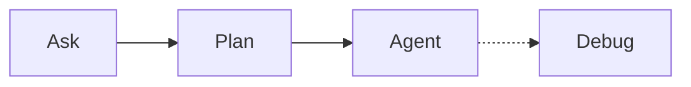
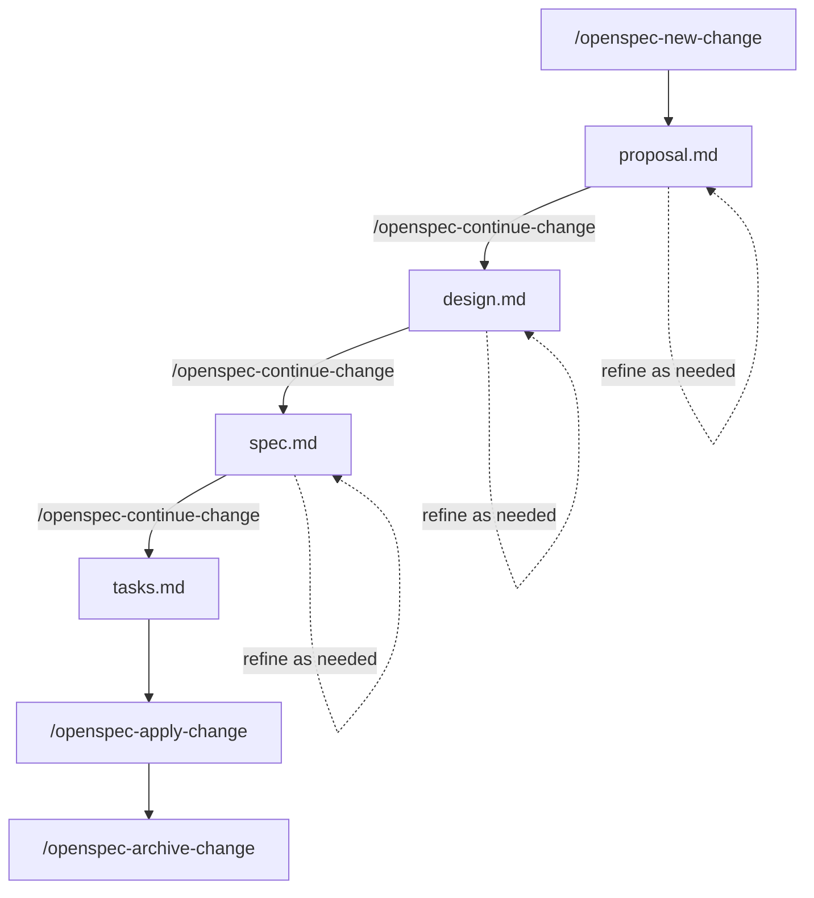

When I originally started working on this post I thought it was going to be about [Apache Kafka](https://kafka.apache.org/) streams and how to get started with it. But over the last few weeks I've been working with _spec-driven development_ using [OpenSpec](https://github.com/Fission-AI/OpenSpec), and the results completely changed my perspective. The workflow is so effective for working with AI coding assistants that I decided to write about it instead.

In this post I'll show how to use [OpenSpec](https://github.com/Fission-AI/OpenSpec) to drive a small project: a local [Apache Kafka](https://kafka.apache.org/) sever with producers and consumers in Python. The real focus is on how OpenSpec shapes the workflow and the benefits you get from it.

## Source Code

> The example project is available on [GitHub: kafka-test](https://github.com/brandon-setegn/kafka-test) including the [specs](https://github.com/brandon-setegn/kafka-test/tree/main/openspec) generated and archived.

# Spec-driven Development
**Spec-driven development** is the practice of writing detailed specifications before—and during—implementation, treating those specs as the source of truth for your project's design and architecture. 

> 💡**When working with AI coding assistants, maintaining comprehensive specs in your repository ensures the AI's context window is filled with what matters most: your project's goals, constraints, and design decisions.**

Rather than the AI inferring intent from scattered code comments or incomplete documentation, it can reference your living specifications to understand *why* the system works the way it does and *how* new changes should align with existing architecture. This fundamentally changes how effectively AI assistants can contribute to your codebase—**they're no longer just pattern-matching on code, they're reasoning from your documented intent**.

### Context Window
While LLMs come with their own inherent  pre-trained knowledge, what matters most for optimizing results for your specific task is the **prompts** you use and the **context** you provide. LLMs can only process so much text at once—this limit is called their ***context window***. Since the context window isn't endless, filling it with the most important information is crucial. OpenSpec helps by clearly documenting our current system state in `specs/` and our desired state in the `changes/` we define.

> Claude Sonnet 4.5 has a context window of 200,000 tokens. Tokens are more than just word count; if you're interested in learning more, check out the [ChatGPT Tokenizer](https://platform.openai.com/tokenizer).
{: .prompt-info }

#### Using Other Chat Modes
You don't need to be doing spec-driven development to benefit from optimizing your context window usage. One of the best ways to do this is to use the different modes your AI assistant offers, especially **Plan** mode.

Even if your AI assistant doesn't come with different modes like Cursor does below, you can still accomplish these steps with the right prompts.  

> Try using the `Plan` mode or prompting it to make a plan before you start coding.
{: .prompt-tip }


<div align="center"><em>Fill Context Window →</em></div>

{: width="420" height="156" }
_Cursor Chat Mode Options_

As you work with your AI assistant, the context window fills with conversation history, code, and files—**eventually pushing out older content** as it reaches capacity. Many newer tools show you how much of your context window is being used. 

{: width="173" height="115" }
_Checking Context Window Usage_

Some AI assistants automatically include files like `agents.md` or `.copilot-instructions.md` in the context window depending on the tool. Keep your most important project-wide rules in these configuration files so they're always available to the AI.

# What is OpenSpec?

[OpenSpec](https://github.com/Fission-AI/OpenSpec) is a lightweight framework and CLI that gives you **prompts** and **skills** to be used with AI coding assistants. It treats **specifications as the source of truth**: by storing design specs directly in your project's repository, they remain accessible for future modifications. While these added **skills** will do much of the work, the CLI will help along the way. But once you've completed your new change and updated your specs then your project no longer depends on the framework.  This makes it easy if you ever move on from OpenSpec without any lockin.

## Setup

### Installing OpenSpec

The quickest way to install OpenSpec CLI is via `npm`:
```bash
npm install -g @fission-ai/openspec
```

> There are other installation methods available—check the [OpenSpec documentation](https://github.com/Fission-AI/OpenSpec/blob/main/docs/installation.md) for alternatives.

### Initializing Your Project

Once installed, navigate to your project directory and run the initialization command:
```bash
openspec init
```

This creates the necessary directory structure and starter files for your specs and skills.

{: width="377" height="263" }

{: width="592" height="401" }
_OpenSpec Init Options_

The `init` command set up these folders with markdown files. For _Cursor_, these files add `skills`—specialized instructions that guide the AI through OpenSpec's workflow for creating proposals, designs, and specifications.

{: width="306" height="475" }
_OpenSpec Skills Mardown Files_

These new skills are available to use in the chat window or command line with your AI assistant. Your tool should add these to autocomplete when using `/` or have a skills menu in the CLI.
> OpenSpec has recently updated the commands it uses, you may see [/opsx](https://github.com/Fission-AI/OpenSpec/blob/main/docs/opsx.md) commands instead.

{: width="606" height="457" }
_OpenSpec Skills in Chat Window_

If you're commands like above, or `opsx` commands, then the project has been initialized.

### Folder & File Structure 
To better understand what will be created, here is a brief overview of the files and folers created.  Checkout the [OpenSpec Getting Started](https://github.com/Fission-AI/OpenSpec/blob/main/docs/getting-started.md#what-openspec-creates) page for more details.
- `specs/` — The ***current specs*** documenting the state of the system. Each spec describes a capability (e.g. local Kafka, Python clients) with requirements and scenarios in a consistent format.
- `changes/` — ***Proposed deltas***. A change typically has a proposal (why and what), a design (decisions and trade-offs), and a task list. When done, the change is archived so the history is preserved.
  - `changes/proposal.md` — Initial proposal defining the problem and high-level approach.
  - `changes/design.md` — Technical design decisions and trade-offs.
  - `changes/tasks.md` — Actionable task list with completion tracking.
  - `changes/specs/spec.md` — Draft specs to be merged into main specs when complete.
    - `changes/archive/` — Completed change files preserving decision history.


## OpenSpec Workflow

As you move through the workflow below, you are creating files that will help with **filling the context window** with the right content. The assistant will see the proposal, design, specs, and task list. This context is critical. It keeps the model aligned with intent and reduces drift, so implementation stays on target and the code you get is better.

This is the workflow we will follow to implement our change with OpenSpec:



### Creating Your First Change
The first change created for the example project was `add-docker-compose-kafka`. To do this we simply use the skill `/openspec-new-change` as follows.

```text
/openspec-new-change add-docker-compose-kafka
```

We haven't had to add any real context yet as all this has done is setup our folder structure.  You should now see the `openspec/changes/add-docker-compose-kafka` folder with a `.openspec.yaml` and little else.

Now we will add a bit more context to our prompt and use the **continue change** skill to create our `proposal.md`.

```text
/openspec-continue-change I want to create a project that runs a local Kafka server in docker.
```

We should see our `propsal.md` file has been created, defining our problem and high level approach to solving it.

> Now is the time to be more creative. Add more context to your prompts, try including other files or projects to learn. Review your `proposal.md`, see what you like and don't like. Then ask the AI assistant to iterate over it until its correct.
{: .prompt-tip }

#### Continuing the Workflow...More to come...

This should be a good start to begin using OpenSpec.  While there are more details to be added here in the future, I'm not going to go through every step of the process since there are already great instructions here: [OpenSpec Getting Started](https://github.com/Fission-AI/OpenSpec/blob/main/docs/getting-started.md#example-your-first-change). 

Also take a look the [GitHub: kafka-test](https://github.com/brandon-setegn/kafka-test) repo for the the specs I generated.

## Wrapping Up

This post focused on **OpenSpec** and how it drives better AI assistant usage. The specs gave a single source of truth for what we wanted in our project. The change (proposal, design, tasks) made the path from idea to code explicit and traceable, and the archived change keeps an audit trail.

Benefits:

- **Clarity before coding** — You spell out requirements and scenarios up front, so implementation has a clear target.
- **Traceability** — You can trace from a scenario in a spec to the code that fulfills it, and from a task list to the files that were added or changed.
- **Better alignment** — Humans and AI assistants share the same reference (the specs and change docs), which reduces drift between intent and code.
- **Lighter than heavy design docs** — OpenSpec aims for enough structure to guide work without drowning in process. It works with Cursor, Claude Code, and other AI coding tools.

No code lives in the specs themselves. They describe *what* the system shall do. The code lives in the repo and is tied to the spec via the change workflow.

## Next Steps

- Explore [OpenSpec and spec-driven workflows](https://intent-driven.dev/knowledge/openspec/) for your own projects.
- Use the [Confluent Python client documentation](https://docs.confluent.io/kafka-clients/python/current/overview.html) to go deeper on Kafka producers and consumers.
- Extend the example (e.g. more topics, different serialization) and document new behavior in the OpenSpec specs and a new change.
- You can run the example locally with Docker Compose and Python. No cloud account is required.
